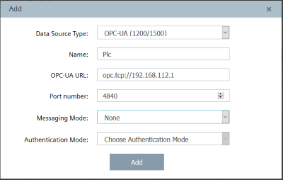
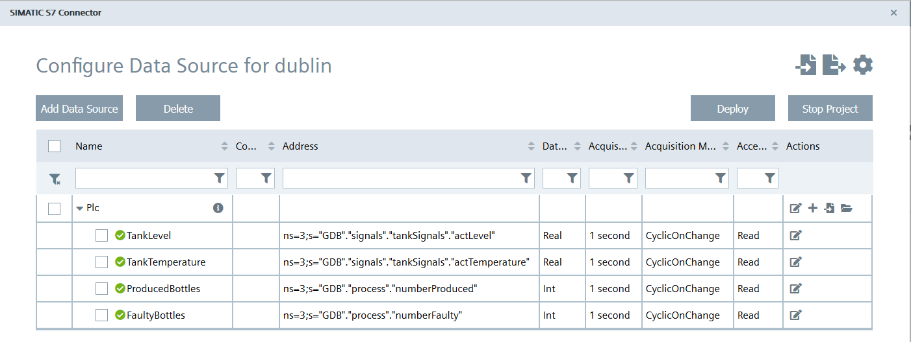
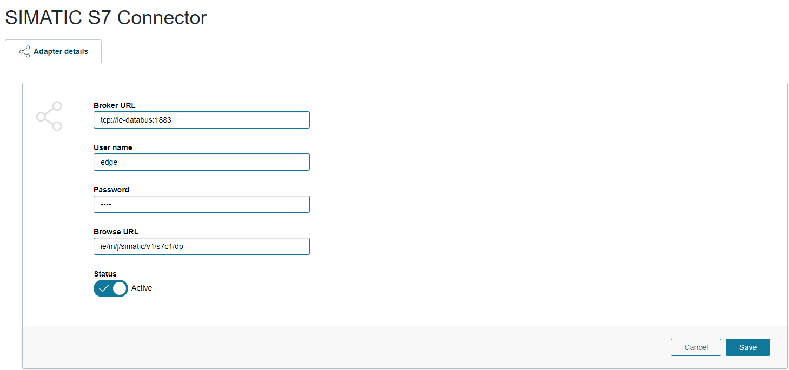
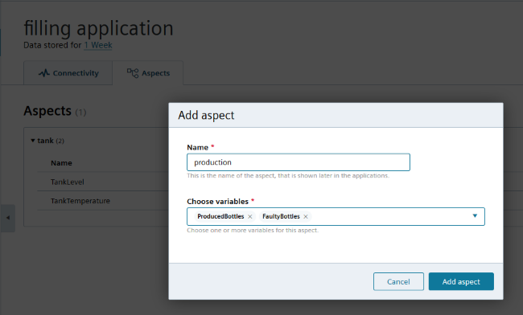
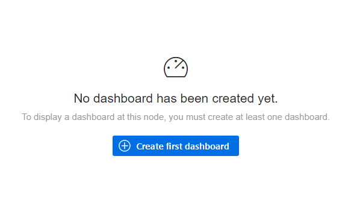
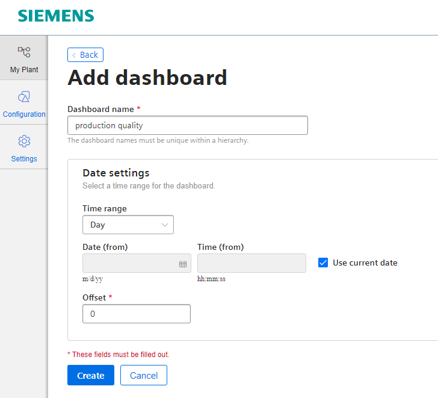
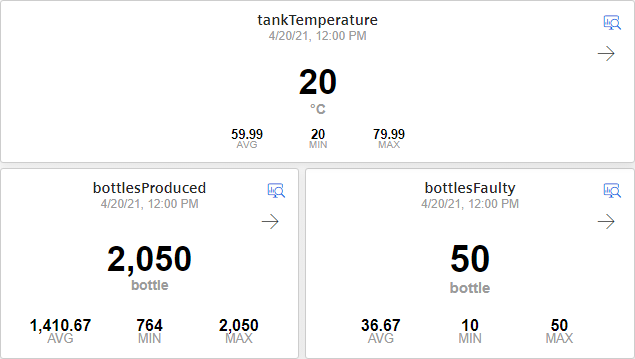
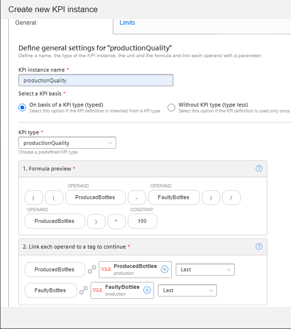

# Configuration

- [Configuration](#configuration)
  - [Configure PLC Connection](#configure-plc-connection)
    - [Configure Databus](#configure-databus)
    - [Configure S7 Connector](#configure-s7-connector)
  - [Configure Data Service](#configure-data-service)
    - [Configure the adapter](#configure-the-adapter)
    - [Configure an asset with variables](#configure-an-asset-with-variables)
    - [Configure an aspect](#configure-an-aspect)
- [Configure Performance Insight](#configure-performance-insight)
    - [Configure a dashboard](#configure-a-dashboard)
    - [Configure widgets](#configure-widgets)
		
## Configure PLC Connection

To read data from the PLC and provide the data, we will use S7 Connector to establish connection with the PLC via OPC UA.
The S7 Connector sends the data to the Databus, where the Data Service app can collect what is needed.
In order to build this infrastructure, these apps must be configured properly:

- Databus
- S7 Connector

### Configure Databus

In your IEM open the Databus and launch the configurator.

Add a user with this topic:
`"ie/#"`

Deploy the configuration.

### Configure S7 Connector

In your IEM open the S7 Connector and launch the configurator.

Add a data source:

Add needed tags:

Edit the settings:

Hint: Username and password should be the same for all system apps, e.g. "edge" / "edge".

Deploy and start the project.

## Configure Data Service

In your IED Web UI open the app Data Service.

Hint: If an error screen appears saying "...unauthorized...", please restart the Data Service app, wait a moment and try again to open it.

### Configure the adapter

On the left bar click the icon "Adapters" and choose the SIMATIC S7 Connector (MQTT).

Click the edit icon on the right to open the adapter configuration.

Add the missing entries for username and password (again "edge"/"edge") and save it.

Hint: Sometimes the Data Service app must be restarted, to take over the adapter changes.

### Configure an asset with variables

On the left bar click the icon "Assets & Connectivity". For the "edge" asset you can add child assets as needed.

Choose "Create first variable" or "Add variable" on the right side to add tags.

To change the storage time period, klick on the link below the asset:

### Configure an aspect

Choose the register "Aspects" to create a new aspect by clicking "Create first aspect" or "Add aspect".

Hint: An aspect can include several variables, but each variable can only be assigned to one aspect.

## Configure Performance Insight

In your IED Web UI open the app Performance Insight.

Hint: When opening the application for the first time a lincese message might pop up (no relationship to IE Hub). Just accept the message and start using the application

### Configure a dashboard

On the main panel the dashboard overview will show the option to create a new dashboard (operating at the highest hirerchical level configured in data service)

Insert a dashboard name and select the time frame that should be display per default for all signals

### Configure widgets

The first widget to be added is a single value display (with Min, Avg and Max Values) for the produced bottles (with good and bad quality)

The second widget is a gauge display for the actual tank level

The third widget is a diagram display for the actual tank temperature

The last widget is a calculated KPI for the production quality

This quality production KPI is shwon using a gauge widget with warning and alarm thresholds

